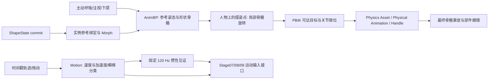

# Stage06 — 运行时人物、原生外观、IK 与运动/惯性底座

## 当前状态

Stage06 的运行时纵向链已建立。Stage06 人物现引用补齐眼睑 Morph 的 Stage05 新配方 `/Game/VamCharacters/C_1facd7a930a8e1eca11a18a6`；旧六参数资产未被覆盖。扩展资产写入 `/Game/VamStage06`。新配方的 Editor Game 已验证左右眨眼；Cooked 复验见下方证据。尚未通过或尚未验证的能力不得算作完成。

## 可放置资产与职责

| 资产/组件 | 职责 |
|---|---|
| `/Game/VamStage06/BP_VamCharacter` | 可放置 Actor；指定 Stage05 CharacterDefinition、Rig、AnimBP、Physics Asset、材质配置。 |
| `/Game/VamStage06/DA_Rig_Eyelids_a11a18a6` | 58 个语义骨骼映射，绑定新 Stage05 Skeleton；IK 骨名由此资产确定。 |
| `/Game/VamStage06/ABP_Eyelids_a11a18a6` | 绑定新 Skeleton 的动画蓝图子类；使用本插件的 PBIK 姿态代理。 |
| `/Game/VamStage06/PA_Eyelids_a11a18a6` | 新网格的 28 个刚体、27 条连通关节；线位移锁定，肘膝等角度限制独立设置。 |
| `/Game/VamStage06/DA_NativeMaterials` | 身体 30 个材质槽、13 个部件的 Stage06 自有材质覆盖；源贴图仍按颜色语义复用。 |
| `/Game/VamStage06/L_Stage06Preview` | 两个人物、固定主补光、地面、PIE 鼠标工具。 |
| `/Game/VamStage06/L_Stage06Automated` | Standalone/Cooked 运行时验证关卡；仅带 `-VamStage06Acceptance` 参数才执行并退出。 |

核心逻辑放在 Runtime 模块：`UVamCharacterComponent` 负责资产/形状/外观所有权，`UVamMotionComponent` 负责运动历史与固定时钟，`UVamInteractionComponent` 负责 Physics Handle 与模式切换，`UVamActivePoseComponent` 负责呼吸/注视/下颌/Idle。`AVamCharacterActor` 是不依赖 CharacterMovement 的展示容器。`AVamPreviewTool` 只提供 PIE 输入与绘制，不拥有角色状态。两个角色各自持有动态材质实例、运动历史、IK 目标和物理组件。

## 每帧数据顺序

`Body` 的动画 Tick 明确依赖 Motion 与 ActivePose 组件。PBIK 禁止骨骼伸长，使用 Rig 映射内的肘膝 preferred bend 和限位；世界空间目标包含旋转，`SetFootLocked` 保存脚的世界目标。IK 自身不做墙面、地面或身体避障接触查询。

`FVamMotionSample` 输出线/角速度、线/角加速度和显式瞬移标志。瞬移清除测试区位移/速度，只广播一次瞬移样本。`FVamSolverClock` 记录固定子步、插值、丢弃步数、暂停、shape revision、瞬移 revision 与 warm-up。超过每帧 8 步的时间不会一次注入大 delta。`FVamCharacterState` 区分动画姿态、刚体姿态、表面和碰撞代理的时间；未接入的表面输出时间为 `-1`，不会热路径读取 GPU 顶点。

黄色两个区域是低成本惯性**见证**：对实际组件平移和旋转加速度做弹簧阻尼响应，用于检验 Stage07/08/09 的输入时序；不是肌肉、脂肪或软体表面。其输入有上限，原始运动样本仍保留真实速度/加速度。

## 交互

在 `L_Stage06Preview` 进入 PIE：橙色 root 点叠在人物腰部，左键拖动平移整个人物，右键拖动改变整个人物朝向；两种运动都调用带时间戳的 `MoveContinuously`。开始拖动时，若人物原本处于受控模式，物理组件让 root 保持运动控制，并对骨盆/双腿与腹部/胸/双臂两条子链开启有限强度的 Physical Animation 局部响应。松开后保留局部响应，以便观察余振；按 `C` 回到完全受控姿态。黄色惯性见证点记录运动输入，不能代替实际刚体。

青色控制点只给映射的关节添加局部旋转：骨盆、腹部、胸、颈、头，左右锁骨、肩、肘、腕、髋、膝、踝、趾和手指。左键水平拖动调 Yaw、竖直拖动调 Pitch，按住 Shift 水平拖动调 Roll。旋转先按 RigProfile 限位裁剪，经过 IK 后再做局部关节限位；root、眼球、下颌和表情没有此类摆姿点。编辑器“人物调试”面板打开后，也可直接点击人物身上的点：root 使用平移 Gizmo，其余点使用旋转 Gizmo；普通编辑器世界中的移动不会产生模拟速度。面板的 Morph 滑块是独立形状调试，不属于摆姿控制点。

鼠标悬停控制点时，点会放大、出现高亮外圈与操作标签；按住拖动时改为更大的黄色中心和醒目的彩色双层外圈，松开恢复。PIE 鼠标光标也会由张开抓手切换为闭合抓手。选中骨点、悬停、实际拖动是不同视觉状态，便于在密集手指控制点之间辨认当前操作对象。

`G` 切布娃娃，`C` 回受控，`P` 暂停惯性见证时钟，`O` 单步，`R` 重置。Physics Handle 抓取仍可由 `UVamInteractionComponent::GrabBone` 单独调用，但不再混用摆姿控制点的鼠标拖动入口。人物容器与 Rig/姿态状态都按实例保存，两个人物的控制点操作互不覆盖。

`SetIKGoal` 可用于头、胸、骨盆和双手足；`SetFootLocked` 保存脚部世界目标。`SetPhysicalMode` 支持受控、局部响应、布娃娃；局部响应使用 Physical Animation 的强度/阻尼与物理混合。抓取使用 Physics Handle 的目标约束，并从目标骨骼向上启用短祖先链的模拟，使肘肩或膝髋可响应，避免只模拟手掌/脚掌时被锁定父关节限制。`ActivePose` 将同一 `BlinkWeight` 写入新 Stage05 的左右闭眼 Morph。`SetAppearanceScalar/Color` 修改角色私有 MID，不修改共享材质。

### 人工检查控制点

重新打开 UE 编辑器以加载新版 Runtime 与编辑器模块；打开 `/Game/VamStage06/L_Stage06Preview`，按 Play，必要时用 Shift+F1 释放鼠标。左键拖橙色腰部 root 点：人物整体跟随，黄色见证点短暂偏离并回弹，骨盆/双腿和腹部/胸/双臂刚体可出现滞后；停下后保留局部响应，按 `C` 恢复受控。右键拖同一点只改变人物朝向，Motion 记录角速度。左键拖青色肩点时手应跟随转动；拖腹部、颈或手指时只能在有限角度内转动，按 Shift 水平拖动调 Roll。眼球、下颌与表情区域没有青色摆姿点。

在普通编辑器视口打开插件“人物调试”面板并选择 Stage06 人物：点击橙点出现平移 Gizmo，点击青点出现旋转 Gizmo，点击“重置骨骼姿态”回到未摆姿状态。此时编辑器未运行物理，不能用静态 Gizmo 位移判断惯性。两个 Stage06 人物同时存在时，操作一个人物不应改变另一个的关节旋转或运动历史。

## 原生外观

Stage06 材质从来源参考图复制并在新包内独立维护，保留原 BaseColor、法线、UV 与透明连接。按有证据的来源区域分为皮肤、清澈眼部层、眼球、口腔、指甲和衣料；为粗糙度、高光及连接至 BaseColor 的 `Tint` 建立参数，皮肤使用 UE Subsurface 着色；每个角色创建私有 MID。未映射来源参数没有伪称为等价 UE 参数。固定主补光在 `L_Stage06Preview`，需要用真实图形编辑器检查接缝、眼部叠层、法线和肤色。

## 自动证据

| 验证 | 结果 |
|---|---|
| `Saved/NativeBuild/stage06-runtime-check.json` | 通过：手部 IK 约 15.43 cm，第二人 0 cm；27 条物理约束；两人 MID 和 `Tint` 参数隔离；连续运动与瞬移状态。 |
| `Saved/NativeBuild/stage06-motion-check.json` | 通过：加速/匀速/减速/停止、左右急转、抬放、纯旋转在 30/60/120 FPS 的峰值差异小于预设 `max(2 cm, 20%)`，停稳后位移 < 0.5 cm。0.25 s 卡顿只执行 8 步，丢弃 21 步。 |
| `Saved/NativeBuild/stage06-pose-controls-check.json` | 通过：54 个四肢、躯干、头部与手指旋转点；root/眼球/下颌排除；腰部 170° 请求限至 35°；肩部摆姿带动手移动 22.2 cm，第二人物 0 cm；root 速度 300 cm/s，骨盆与腹部刚体模拟、hip 根保持运动控制。 |
| Standalone `Saved/Stage06Acceptance.json` | 通过：实际 Play 世界中的 IK、手部刚体随抓取目标位移、释放、布娃娃、受控恢复和瞬移。 |
| Windows Cooked `Saved/stage05-blink-stage06-packaged-runtime.log` | 新 Stage05 人物重验通过：`runtime_chain_verified`，左右闭眼权重峰值均超过 0.99，28 刚体、27 约束；打包日志 `Saved/stage05-blink-stage06-package.log` 为 `BUILD SUCCESSFUL`。 |
| Windows Cooked `Saved/stage06-pose-packaged-runtime.log` | 控制点改造后重新 Cook/打包并运行，`runtime_chain_verified`，28 刚体、27 约束；独立插件 BuildPlugin 的 Editor、Development、Shipping 目标均编译成功。 |

## 尚未验收的范围

- Stage05 新配方已有来源左右闭眼 Morph；运行时两侧权重均达到约 0.999。真实 GPU 画面中的眼睑闭合、睫毛与角膜叠层仍需目视验收。
- 足底锁定是世界目标保持；墙面、地面、身体避障需要额外接触查询和约束。不能把 PBIK 视为完整接触物理。
- `P/O/R` 与面板的暂停/单步/重置作用于 Stage06 固定惯性见证时钟；Chaos 刚体的整世界暂停和单步尚未接入。
- 已验证抓取刚体的可测位移与受控恢复；关闭主动动作后的 Chaos 长时间接触静态平衡仍缺少独立数值验收。
- 尚未建立 Stage07 全身肌肉/软体、Stage08 衣服、Stage09 头发求解器；黄色见证点只验证输入与时序。
- root 拖动可使现有 Physics Asset 的 28 个刚体沿骨盆与腹部两条链响应；细手指没有逐节刚体，其摆姿旋转受限位控制，但不会产生逐节独立惯性。衣服、头发与软组织的真实动态仍属于后续阶段。
- 当前打开的 UE 编辑器占用了 `DA_Rig_Eyelids_a11a18a6.uasset`，因此该文件的显式新限位尚未覆盖保存。现有腰腹关节沿用资产内的 35° 上限，手指/脚趾由 Runtime 的有限角度回退规则约束；`Scripts/ue_stage06_pose_rig_upgrade.py` 可在关闭占用该资产的编辑器后写入新的逐关节 Rig 限位。独立编辑器验收按现有资产检查了实际 35° 裁剪。
- 当前 AnimBP 的基础输入是形状参考姿态和主动微动作；尚未接入通用行走动画状态机或运动角色 Pawn/Character 薄包装。现有展示 Actor 不依赖 CharacterMovement。
- 真实图形环境下的材质接缝/眼部视觉比对尚未完成；命令行 `-nullrhi` 验证了 Cooked 运行链，但无法替代目视检查。
